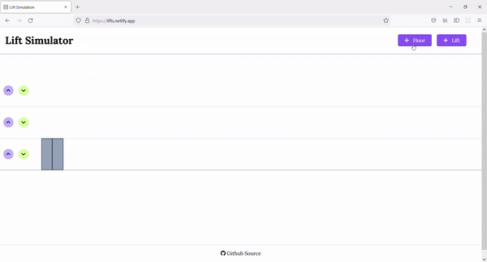
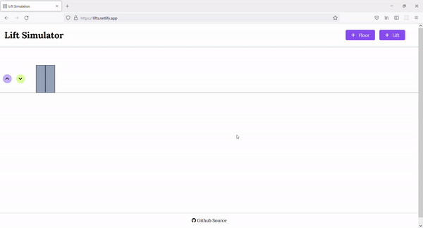
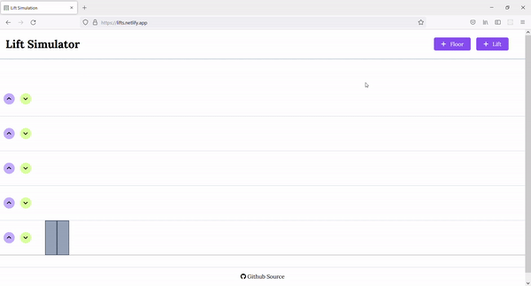

# Lift Simulation
Lift simulation built using HTML, CSS, JS.
 
**[Live link](https://lifts.netlify.app/)**

## Features ✨
- Lift open and close door simulation
- Lift up and down floor simulation
- Add multiple floors
- Add multiple lifts
- Handle multiple requests 

## Demo 💻
### Lift movement demo ⬆

### Add floors ➕

### Add lifts ➕

### Handle multiple lifts and requests 🚀

